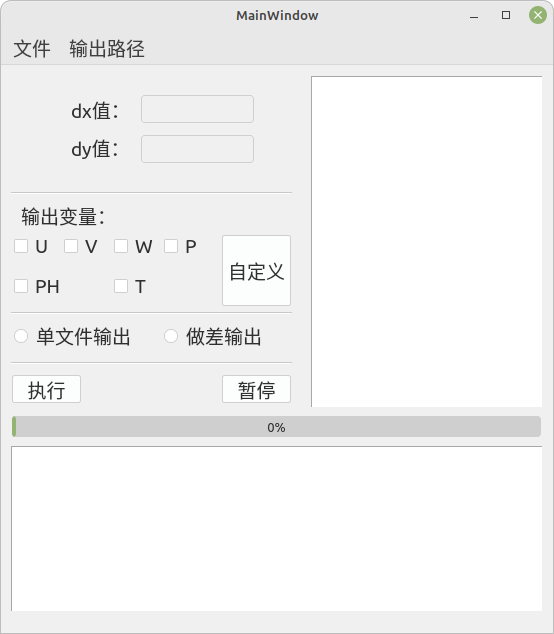
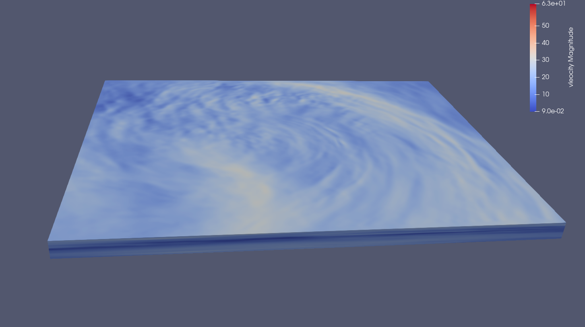
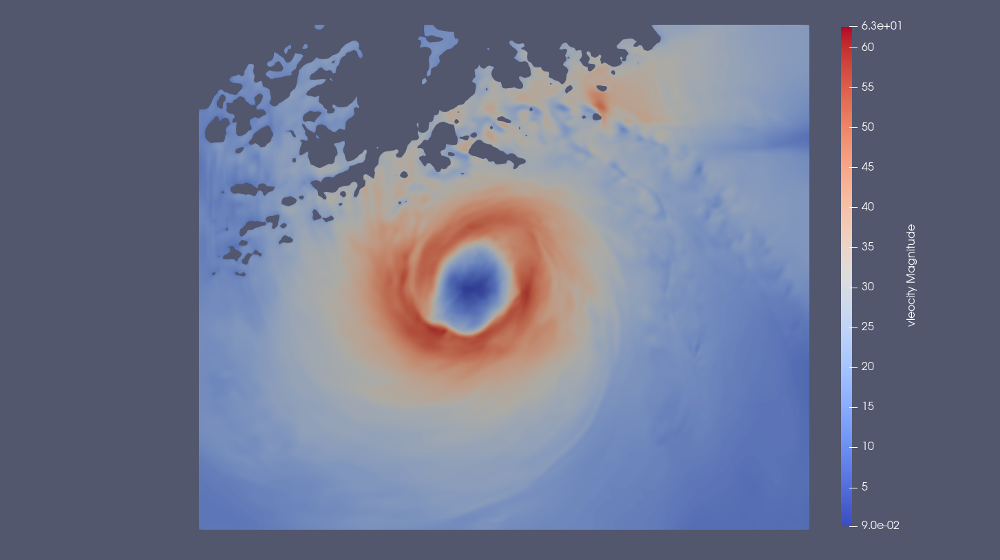
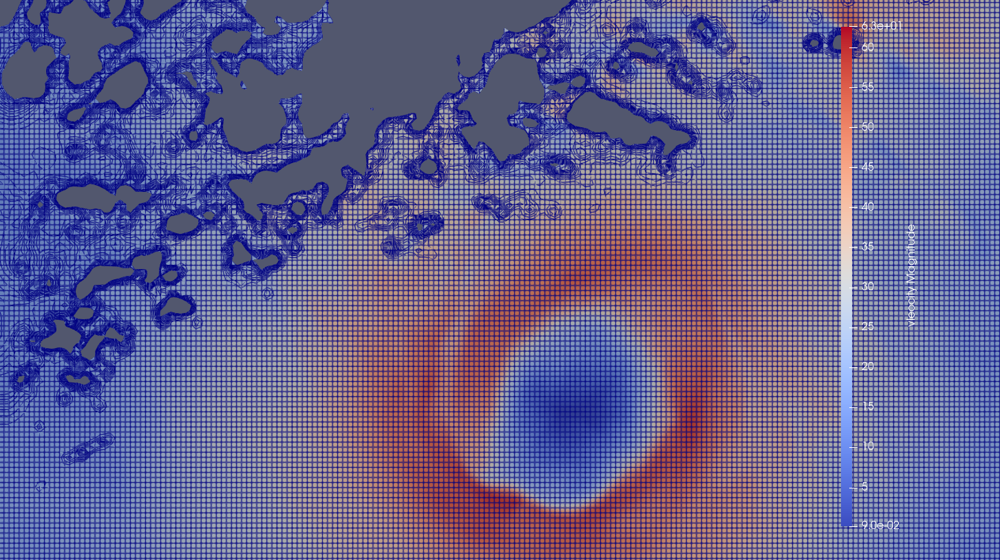
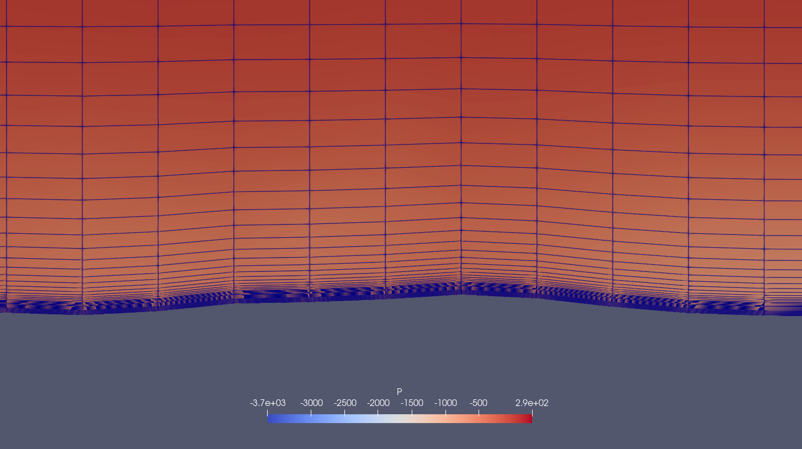

# Visualization_wrfout

## 此代码是对WRF软件的结果进行可视化处理

Weather Research & Forecasting Model (WRF) 即天气研究与预报模式程序
通过对数据进行处理，输出paraview可读取的格式

## 基于库和使用方法
sys
PyQt5
netCDF4
numpy
vtk

运行方式：python3 main.py

## 使用paraview后的可视化结果展示

